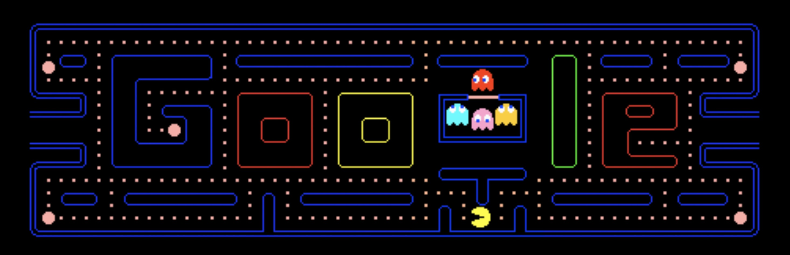
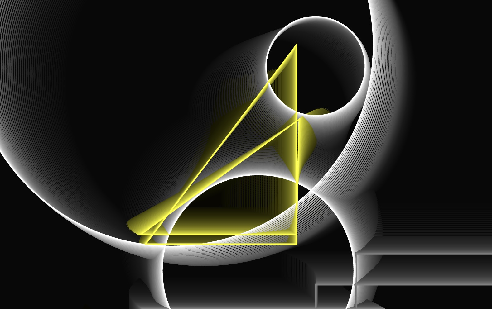

# xili0210_9103_tut10
Part 1: Imaging Technique Inspiration:
I've chosen Piet Mondrian's artwork "Broadway Boogie Woogie" as my inspiration. Renowned for its vibrant colors and geometric shapes, especially the dynamic relationships between the red, blue, and yellow blocks, this abstract masterpiece captivates with its rhythm. I aim to infuse this dynamic and brightness into my Pac-Man game. By integrating similar blocks and geometric patterns onto the game map, I can modernize its aesthetic, enhancing visual appeal while paying homage to Mondrian's artistry.

Part 2: Coding Technique Exploration:
To achieve the dynamic blocks and geometric patterns reminiscent of "Broadway Boogie Woogie," I plan to utilize p5.js for coding my Pac-Man game. p5.js is a JavaScript library for creative coding, facilitating the creation of interactive graphics and animations on web pages. Leveraging p5.js's drawing functions, I can effortlessly render geometric shapes on the game map and animate them with dynamic effects such as color changes, movement, and flickering. Below is a sample implementation showcasing how p5.js can be used to create simple geometric shapes and animations:

Sample Implementation Link: p5.js Geometry and Animation Example
This coding technique will assist in realizing the dynamic blocks and geometric patterns featured in "Broadway Boogie Woogie," thereby adding visual delight and artistic flair to my Pac-Man game.

